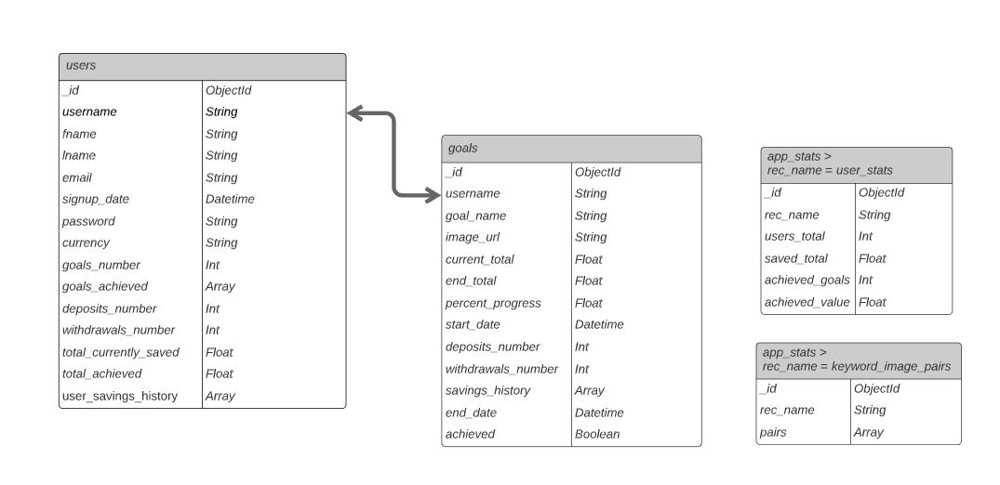

# Track

Track is an application that assits users in tracking their savings towards their goals. Users can sign up to the app and create goals. When a user deposits and withdraws savings, these are stored in the users savings history and the user instantly recieves savings insights.

The app is writen using Python and Flask for the backend, wired up to MongoDB. On the frontend, HTML5, CSS3 and JavaScript/jQuery provide an interactive user interface.  The app provides full CRUD functionality for user profiles and user savings goals.

The application will be deployed to Heroku and will be accessible here: </>. 

## Contents
1. [UX](#ux)
    - [Users](#users)
    - [User Stories](#user-stories)
    - [Goals](#resulting-goals)
    - [Wireframes](#wireframes)
 2. [Information Architecture](#information-architecture)
 3. [Design Choices](#design-choices)
     - [Colours]
 4. [Features](#features)
     - [Navigation](#navigation)
     - [Landing Page](#landing-page)
     - [Log In](#log-in)
     - [Sign Up]#(#sign-up)
     - [Dashboard](#dashboard)
     - [Goal View](#goal-view)
     - [User Profile](#user-profile)
     - [404](#404)
     - [Goals FAB Menu](#goals-fab-menu)
     - [Flashed Messages](#flashed-messages)
     - [Footer](#footer)
     - [Future Features](#future-features)
 

## UX
### Users
Track's users are likely to be casual savers who have specific goals in mind. These goals might be short-term or long-term goals, and with targets of any value (think new playstation vs new house). Users will need to be able to register for and sign in to their user account so that their individal profile and goals data persists after ending the session. 

These users will need to be able to create goals and keep track of their savings ("deposits" and "withdrawals"). Circumstances change, and users will need the ability to extend their goal's end date into the future or bring it forwards if it looks like they'll meet their goal early. Alternatively, users might choose to increase or decrease their goal's target amount. 

### User Stories 

1. "I've always dreamed of buying an old VW camper van. It's a long-term goal but I want to start making progress towards it. I want to save a little bit here and there, and work out when my goal might be achievable."
2. "I want to buy a house this time next year. I know how much I need to save in total, and I'm happy to save a little extra each month to meet my goal if I need to."
3. "My kids really want to go to Disneyland. They get an allowance for helping around the house and they save it towards their dream holiday. At the moment we keep track of it on paper, but it'd be great to do this on an app so that they could see their savings grow towards their goal in a more visual way." 
4. "Usually I'm saving towards three or four different things. A couple are usually smaller goals that I can meet quite quickly, while others might be a bit more long term with higher amounts needed to be saved. It'd be great to track my savings for all of these in a single app, and keep a record of the goals I've achieved to keep me motivated."

### Resulting Goals

Based on the four user stories set out above, there are five main goals for this project: 
- Allow users to deposit/withdraw savings towards three or four different goals
- Store a history of user savings activity
- Provide visual indications of savings progress
- Allow users to increase/decrease their goal total
- Allow uesrs to extend/bring forwards their end date

### Wireframes
These wireframes were sketched at the starat of the design process:
- [Landing Page](</>)
- [Log In Page](</>)
- [Sign Up Page](</>)
- [Dashboard](</>)
- [Goal View](</>)
- [User Profile](</>)
- [Savings History](</>)
- [404](</>)

Based on the preliminary sketches above, seven sets of wireframes were created using [Miro](https://miro.com/):
- [Landing Page](</>)
- [Log In Page](</>)
- [Sign Up Page](</>)
- [Dashboard](</>)
- [Goal View](</>)
- [User Profile](</>)
- [Savings History](</>)
- [404](</>)

## Information Architecture 
All app, user and goals data are stored in three MongoDB collections, ```"app_stats"```, ```"users"```, and ```"goals"```. MongoDB is a non-relational database, and the users and goals collections are linked by the user's username, which is unique to the user. Tables showing the architecture of each collection are shown below:



## Design Choices

### Colours

## Features

### Navigation
</>
- Navigation is mainly provided by the nav bar at the top of the page. The nav bar displays the track name and trending_up arrow icon, which together provide the app brand logo.
- If a user is not in session, the nav bar displays links to the home page, and the log in and sign up pages. 
- If a user is in session, the nav bar display links to the home page, the dashboard, a dropdown menu with links to the user's goals in it, the user's profile. There is also a link that logs the user out of track when clicked. 
- On tablet and mobile devices, the nav bar displays the same links as above, but they are in a side nav menu that is displayed when a user clicks the nav bars icon. 
- If the user has not reached their limit of saving towards four goals at one time, the dropdown menu with links to the user's goals also displays a link to add a new goal. 

### Landing Page
</>
- The landing page presents the user with a three-panel auto-sliding carousel. The carousel occupies the full width and height of the viewport.
- Each panel has a different CSS gradient background that uses the two main blue/green colours used across the app. 
- A banner is displayed across each carousel panel. The header on this banner displays statistics read from the app_stats collection in MongoDB.
    - If the user is not logged in, the subheader prompts the user as to how them signing up and saving will add to these statistics (number of users, amount saved, goals achieved). 
    - If the user is in session, the subheader informs the user as to how their savings activity has increased these overall statistics of the app. 
- If the user is not logged in, each carousel panel displays two call-to-action buttons. These link to the login and signup pages. 
- If the user is logged in, each carousel panel displays one call-to-action button. This links to the user's dashboard page. 

- Below the carousel, there are three cards in a row which each occupy a third of the viewport. 
- If the user is not logged in, each card displays a mockup of the track app at different stages (signing up, saving, completing a goal) with a corresponding title. Underneath the title is a brief overview, and then a call-to-action button.  
- If the user is in session, each card displays a mockup to differnt parts of the app (dashboard, profile, savings history) to provide quick links to the user to reach each page. 

### Log In 
</>
- The log in page presents the user with a card containing the login form. At the top of the card is the log in header. 
- The log in form has two input fields, username and password. Each field is identified to the user by placeholder text and helper-text.
- Below the form is a Log In button which submits the form for server-side user authentification.
- Below the login button is a link which redirects the user to the sign up page, and the user is prompted to sign up if they do not have an account yet. 
- Client-side validation prevents the user from submitting the log in form with empty fields. 
- If the user attempts to log in with a username that does not exist, they are redirected to the sign up page and a flashed message prompts the user to sign up. 
- If the user attempts to log in with a username that does exist, but with the incorrect password, they are redirected to the login page and a flashed message feedsback to the user that the password was incorrect. 
- If the user logs in successfully, they are redirected to their dashboard. 
- If the user tries to access the log in page but they are already in session, they are redirected to their dashboard and a message is flashed to feedback to the user why they have been redirected. 

### Sign Up
</>
- The sign up page presents the user with a card containing the sign up form. At the top of the card is the sign up header.
- The form has seven input fields: a currency switch, first name, last name, username, email address, password and password check. Each field is identified to the user by placeholder text and helper-text. 
- Below the form is the sign up button, which submits the form for server-side validation and if successful, inserts the new user into the users collection in MongoDB. 
- Below the sign up button is a link which redirects the user to the log in page, and the user is prompted to log in if they already have an account. 
- Client-side validation prevents the user from submitting the sign up form with any empty fields. In addtion, client side validation prevents the form beign submitted if any of the fields are not of the required length or type, and if the two passwords do not match. 
- jQuery provides instant validation feedback to the user as they focus out of the input fields, and on keyup/keydown in fields with validation errors. 
- If the user signs up succesfully, they are redirected to the login page and a message is flashed prompting them to log in with their new details. 
If the user tries to access the sign up page but they are already in session, they are redirected to their dashboard and a message is flashed to feedback to the user why they have been redirected. 

### Dashboard
</>
If the user tries to access the dashboard but they are not in session, they are redirected to the login page and a message is flashed to feedback to the user that they need to log in to view their dashboard.  

#### Main Card 
- At the top of the main card, the user's first name and last name is displayed.
- Underneath the user's name, a link to the user's profile is shown. 
##### Main Card: User's First Goal 
- If the user has only just signed up to track, and has no goals yet, the main card prompts the user to create a goal to start saving. Below this prompt, an input box allows the user to enter a name for their goal. 
- Once the user has entered a name for their goal, clicking the create goal button below the input field takes them to the create goal card. 
##### Main Card: User's First Deposit 
- If the user has created their first goal, but has not yet made their first savings deposit, the main card displays their goal's name and a start saving button. Clicking on the button takes the user to their goal's page. 
- Below the start saving button, the user is informed they will recieve saving insights as soon as they make their first deposit. 
##### Main Card: After First Deposit 
- After the users first deposit, the main card displays how many goals the user is saving towards. If this is only one goal, it also displays the name of this goal. Clicking on the goal name redirects the user to the goal's page. 
- Below this, the total amount that the user has saved with track is displayed. 
##### Main Card: After First Achieved Goal
- After the first goal is achieved, the amount of goals achieved is also displayed at the bottom of the main card, under the amount saved. 

#### Recent Activitiy Card 
- Once a user has made at least one deposit towards their first goal, the recent activity card shows on the dashboard below the main card. 
- The recent activity heading is at the top of the card. Below this is a link to the savings history page, which from this route will display the users entire savings history. 
- The table in the recent activity card displays the users most recent savings activitiy, with up to the five most recent events.
    - In the first column, the amount that was deposited or withdrawn is shown. If it was a deposit, it is shown in green. If it was a withdrawal, it is shown in red. 
    - In the second column, the name of the goal the event relates to is shown. 
    - In the third column, the date of the event is shown. 
#### Achieved Goals Card
- Once a user has achieved their first goal, the achieved goals card is shown underneath the recent activitiy card. 
- The achieved goals heading is at the top of the card. Below this is the achieved goals table, which displays all of the users achieved goals. 
    - In the first column, the achieved goal name is shown. 
    - In the second column, the total amount saved for the goal is shown. If the amount saved exceeds the goal target, the total amount is shown, including the amount that exceeds the goal target. 
    - In the third column, the date that the goal was achieved is shown. 
#### Add Goal 
- Once the user navigates to the add goal card, all the other cards on the dashboard are hidden. 
- Underneath the Create Goal header are five input fields.
    - The first two fields are for the goal name and the total amount the user is aiming to save for the goal. This must be a positive value. 
    - The third field allows the user to set a target end date for their goal. On focusing into this field, the datepicker is automatically opened. The user can only select a date that is in the future. 
    - The fourth field allows the user to select how they would like to set the image for their goal. 
        - The first way a user can do this by supplying an image URL. If the user selects this option, the fifth field unfreezes and the uesr can enter the image URL there. As a basic security measure, the URL must end in .jpg, .jpeg or .png. This is validated on form submit. 
        - The second way a user can do this is by supplying a keyword for their image. If the user selects this option, the fith field unfreezes and prompts the user to enter a keyword for their goal. On form submit, a JavaScript promise fetches an image URL from [Unsplash](https://unsplash.com/) that relates to the keyword and writes this to the goal's record in MongoDB as the image URL. If no matching image is found, a URL for a generic savings image from [Unsplash](https://unsplash.com/) is provided instead. 
        - If a user does set the image for their goal by keyword, the keyword and image URL are stored as an array in the ```keyword_image_pairs``` record in the ```app_stats``` collection in MongoDB.
        
### Goal View
</>
If the user tries to access a goals page but they are not in session, they are redirected to the login page and a message is flashed to feedback to the user that they need to log in to view their goals. 

#### Main Cards
- The first card on a user's goal page gives the goal title and below that, the goal's target amount. Below this card, another card shows the goal's image and a progress bar with the amount saved on the left-hand side, and the amount remaining on the right hand side.

#### Deposit/Withdraw Buttons and Cards
- On mobile and tablet devices, deposit and withdraw buttons are displayed below the goal image and progress bar. On larger screens, these are displayed in the right-hand column opposite the progress bar. 
##### Deposits
- Clicking on the deposit button takes the user to the deposit card and hides all other cards.
- The deposits card has a deposit header, and below this, the current total of the goal is displayed. 
- A back link in the top corner of the card hides the deposit card and displays all of the goal's normal cards. 
- An input field allows the user to enter the amount they would like to deposit, to two decimal places. 
- Four quick deposit buttons allow the user to enter the amount they would like to deposit by clicking one of the four options with increasing amounts in. 
- Clicking on the deposit button adds the amount onto the user's saved total and the user is redirected back to the main goal page. A flashed message feedsback to the user the amount that has been deposited. This deposit is then visible in the user's recent activitiy. 
##### Withdrawals
- If a user has not yet made any deposits (and therefore withdrawing would take their savings into negative numbers) the withdraw button is disabled and the withdraw card cannot be accessed.
- If the user has a positive savings total, the disabled class is removed from the withdraw button. Clicking on the withdraw button takes the user to the withdraw card and hides all other cards.
- A back link in the top corner of the card hides the withdrawal card and displays all of the goal's normal cards. 
- The withdraw card has a withdraw header, and below this, the current total of the goal is displayed. 
- An input field allows the user to enter the amount they would like to withdraw, to two decimal places. 
- Four quick withdraw buttons allow the user to enter the amount they would like to deposit by clicking one of the four options with increasing amounts in. If the quick deposit card contains a value that is greater than the users current total amount saved, the card is disabled, as the user cannot withdraw more than the current amount saved. 
- Clicking on the withdraw button  subtracts the amount from the user's saved total and the user is redirected back to the main goal page. A flashed message feedsback to the user the amount that has been withdrawn. This withdrawal is then visible in the user's recent activitiy. 

#### Progress Doughnut Card
- The progress chart is visible as soon as the user creates the goal. The chart itself displays the users progress towards completing their goal. 
- The text inside the progress chart lets the user know what percentage of their end total they have already saved. 
- Text below the progress header in the card gives the user some basic feedback on how close they are to completing their goal (one quarter, one third, half way...). If the user has completed their goal, this text congratulates them on reaching their target. 

#### Recent Activity Card 
- This card is visible once the user makes their first deposit towards the goal. 
- Under the recent activtiy header there is a link which allows the user to view the full savings history for the goal. 
- Below this is the table which shows the user's most recent savings activity for the goal. It shows up to the five most recent savings events and is sorted in reverse chronological order. 
    - The first column shows the amount deposited/withdrawan. Deposits are shown in green and withdrawals in red. 
    - The second column shows the date the activitiy occured on. 
    
#### Time Remaining Card 
- This is visible as soon as the user creates the goal. The card shows the user which day they are on out of the total number of days until their target end date. 
- On hover, this text switches to show the user how many days are remaining until their target end date. 
- Below this text, the start date of the goal and the target end date are displayed. 

#### Deposits Gauge 
- Once the user has made their first deposit towards the goal, the deposits gauge card becomes visbile. This card shows the user the number of deposits and withdrawals they have made. 
- The deposits portion of the gauge is on the left-hand side. Below this side, the number of deposits is displayed in text. 
- The withdrawals portion of the guage is on the right-hand side. Below this side, the number of withdrwals is displayed in text. 

#### Deposits/Withdrawals Statistics 
- Once the user has made their first deposit towards the goal, this statistics card becomes visible. 
- Infomration about the user's smallest, biggest and average deposit towards the goal is displayed in green on the left-hand side.
- Information about their smallest, biggest and average deposit in red on the right-hand side. 

#### Savings Forecast
- This card is visible to the user as soon as they create their goal. 
- On the left hand side, the user can see their average deposit value per day/week. If this is above the necessary amount to meet their goal, it's text is green. If it is below it, its text is red.
     - If the user has not made any deposits yet, the card shows the user's average savings as 0 on the left hand side. 
- On the right hand side, the card shows the user how much they need to save each day/week to achieve their goal. 
- Once the user begins to make deposits and withdrawals, the savings forecast will predict how many days it will take the user to acheive the goal at their current rate of saving.
    - If this will be before the target end date, it lets the user know how many days early they will achieve their goal, and prompt them to increase their target amount if they want to. 
    - If this will be on the target end date, it lets the user know they are on track to achieve their goal on the set target date. 
    - If this will be after the target end date, it lets the user know they might achieve their goal after their chosen date, and by how many days. It then prompts them to extend their end date if they need to and links to the edit goal card. 
- The savings forecast will update after each deposit/withdrawal.
- If user has achieved their goal, the savings forecast card is hidden, as there are no more savings required to achieve the goal. If the user edits their goal to have a higher end target, the card will reappear with a new forecast. 

#### Congratulations Card 
- Once the goal is acheived, a card is displayed to the user at the top of the goal's page with a heading congratulating them on achieving their goal. 
- Below the congratulations message, the amount the user has saved is displayed, including if they have exceeded their original target amount. 

#### Edit Goal 
- At the top of the edit goal card, the edit goal header is displayed. Below this are two links. One link which takes the user back to the goal's main view. The other takes the user to the delete goal card. 
- The edit goal form has four input fields. They allow the user to change their goal name, image url, goal total and goal end date. 
- As soon as the user focuses on the goal end date field, the datepicker is opened. 
- Client-side validation prevents the user from submitting the edit goal form with any empty fields.
- Once the user submits the form, the goal's record is updated in MongoDB and a the user is redirected to the goal's main page. A flashed message feedsback to the user that the goal has been updated. 

#### Delete Goal 
- When the user navigates to the edit goal card, they are asked if they are sure they want to delete their goal
- The user must succesfully confirm their password before they delete their goal. The form will not submit if there is no password entered, or if the entered password is less than six characters (as this is the minimum possible password length). 
- On succesfully deleting their goal, the user is logged out and redirected back to their dashboard. A flashed message feedsback to the user that their goal has been deleted. 

### User Profile
</>
If the user tries to access their user profile but they are not in session, they are redirected to the login page and a message is flashed to feedback to the user that they need to log in to view their profile. 

#### Main Card 
- At the top of the main card on the user profile page is the user's first name and last name. Below this are links to update the user's profile and password. 
- Below the heading, the users username, email address, signup date and chosen currency are displayed. 
- Clicking on the update profile link hides the main card and displays the update profile card to the user.
- Clicking on the update password link hides the main card and displays the update password card to the user.
#### Update Profile 
- At the top of the update profile card, the update profile header is displayed. Below this are two links, one takes the user back to the main profile card. The other takes them to the delete profile card. 
- The update user form has five input fields. They allow the user to switch currency, edit their first name, last name and email address. The user is unable to update their username, as this forms the relation between a user's record and their goals in the MongoDB collections.
- The update profile form is validated. All fields must be filled in before the form will submit. 
- The user must confirm their password for their user profile information to be updated. If they do not succesffuly confirm their password, their record is not updated in MongoDB and a flashed message feedsback to the user that the password was incorrect. 
- One the form is succesffuly submitted, the user is redirected to their profile page and the main card is displayed. 
#### Delete Profile
- When the user navigates to the delete profile card, they are asked if they are sure they want to delete their profile. 
- The user must succesfully confirm their password before they delete their profile. The form will not submit if there is no password entered, or if the entered password is less than six characters (as this is the minimum possible password length). 
- On succesfully deleting their profile, the user is logged out and redirected to the index page. 
#### Update Password 
- At the top of the update password card, the update password header is displayed. Below this is one link, which takes the user back to their profile. 
- There are three input fields in the update password form. The first asks the user to confirm their current password. The next two ask the user to input their new password and confirm their new password.
- Client-side validation requires that the current password entered is six characters or more, as this is the minimum password length. It also requires that the new password and confirm new password inputs match. Instant feedback about this is provided to the user. 
- Server-side validation also validates the inputs of the form upon submission. 
- Once the password is updated, the user is redirected to the main profile card and a flashed message feedsback to the user that their password has been updated. 
### Savings History
- The savings history page has one card on it. There is a savings history header at the top of the card. 
- The user's first name and last name are also displayed below the header. 
- Just above the savings history table is a print icon. If the user clicks on this icon, the print dialog box is opened so the user can easily print the page. 
- A link below the print icon takes the user back to their dashboard. 
- The user can route to the savings history page from the dashboard or from the page of an individual goal. Depending on which route the user takes, different savings activitiy is displayed. For both routes, the savings history is displayed in reverse chronological order. 
#### Full Savings History
- If the user is routed to the savings history page from the dashboard, their full savings activity for all goals is displayed in a table. This is true even if the goal has since been deleted by the user, as the savings history is stored in the user's record. 
    - In the first column is the amount deposited/withdrawn. Deposits are displayed in green and withdrawals are displayed in red. 
    - In the second column, the goal name that the activity relates to is displayed. 
    - In the third column, is the date the activity occured on.
#### Goal Savings History
- If the user is routed to the savings history page from an individual goal, only the savings activitiy for that goal is displayed in a table. This page is never visible once the goal has been deleted.
    - In the first column is the amount deposited/withdrawn. Deposits are displayed in green and withdrawals are displayed in red. 
    - In the second column is the date the activity occured on. 

### 404
</>
- If the user tries to route to an unfound page and a 404 error message is returned, flask reroutes the user to the 404 page.
- The 404 Page just informs the user that there has been an error finding the page they requested.
- If the user is not logged in, a button redirects the user back to the landing page. 
- If the user is in session, a button redirects the user back to their dashboard. 

### Goals FAB Menu
</>
- The floating action menu is visible on the user's dashboard, goal, user profile and savings history pages.
- On hovering over the main icon, the menu expands vertically. 
- If the user already has goals, a menu card for each goal shows the image assigned to the goal. Clicking on these redirects the user to view the respective goal. 
    - If the user does not have any goals, this menu only displays a card with an add goal symbol which redirects the user to the add goal card on the dashboard. 
    - If the user has less than four goals, this menu displays the card with the add goal symbol above the cards for their existing goals. 
    - If the user already as four goals, the card with the add goal symbol is not displayed. 
    
### Flashed Messages
</>
- Flashed messages are displayed to the user as a toast alert. The messages are short and provide basic feedback to the user. 
- On mobile and tablet devices, toasts are displayed to the user across the bottom of the screen. 
- On larger devices, toats are displayed to the user in the top right-hand corner of the screen. 

### Footer
</>
- On mobile and tablet devices, the brand logo is displayed in the center of the footer, with the footer links below it.
- On large screen devices, the brand logo is aligned to the left-hand side of the footer, with the footer links aligned to the right-hand side of the footer. 
- If the user is not logged in, the brand logo links to the index page and the footer links displayed are for the home page, the log in page and the sign up page. 
- If the user is in session, the brand logo links to the user's dashboard. The footer links displayed are for the index page, the user's dashboard and profile, and a link that logs the user out.

### Future Features
1. The Savings History page would be more functional if users could select a specific date-range for the savings activity they would like to see. At present, this page displays the entire savings history for a single goal, or a user's entire savings history, depending on how they route to the page. 
2. I would like to provide login/signup validation to the client before the form submits by making AJAX calls after the user stops typing for a period of time. 
3. A users password is currently only restricted by the minimum length of six characters. I would like to improve user security by making sure the user is including a mix of characters, and that their password does not match their name, e.t.c. I would also like to offer a way for users to reset their password if it has been forgotten. 


