# Testing for Track Savings App

The readme file for this project can be found [here](README.md).

The respository for this project can be found [here](https://github.com/mvmolloy/milestone-project-3). 

This app has been deployed to Heroku and can be found [here](https://track-savings-app.herokuapp.com/). 

## Contents

1. [Automated Testing](#automated-testing)
    - [HTML](#html)
    - [CSS](#css)
    - [JavaScript](#javascript)
    - [Python](#python)
2. [User Stories Testing](#user-stories-testing)
    - [Story One](#story-one)
    - [Story Two](#story-two)
    - [Story Three](#story-three)
    - [Story Four](#story-four)
3. [Manual Testing](#manual-testing)
    - [Navigation](#navigation)
    - [Index](#index)
    - [Login](#log-in)
    - [Sign Up](#sign-up)
    - [Dashboard](#dashboard)
    - [View Goal](#view-goal)
    - [Profile](#profile)
    - [Savings History](#savings-history)
    - [404](#404)
    - [Log Out](#log-out)
    - [Footer](#footer)
4. [Bugs Fixed](#bugs-fixed)
5. [Bugs Unfixed](#bugs-unfixed)

## Automated Testing
### HTML

HTML Validation has been carried out on all HTML pages using the [W3C Markup Validation Service](https://validator.w3.org/). As the app's HTML mades wide use of Jinja Templating, the HTML code to validate has been taken from the page source of each page from the deployed version. 

#### Testing: Index Page

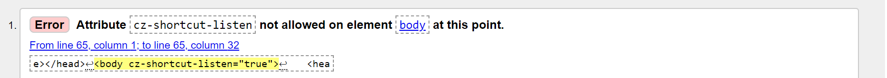

This error is caused by a an attribute injected by [Colourzilla](https://www.colorzilla.com/), a colour picker extension installed in my browser. Running the browser in incognito mode where the extension is disabled removes the error. 

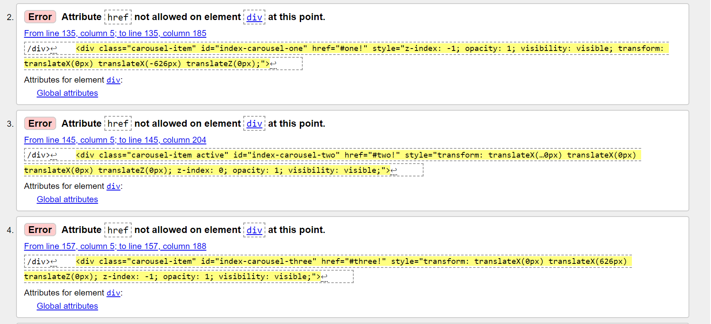

These href attributes are part of the code from [Materialize's Carousel](https://materializecss.com/carousel.html) and can be seen in the example code they provide. They link each carousel panel div to its content and removing them would remove this functionality. The href attributes have been left in the code. 

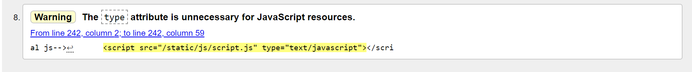

JavaScript script links no longer need a type attribute. I have removed the type attribute from the JavaScript Script Link and this error has been resolved. 
 
### Testing: Log In Page/Sign Up Page 

No HTML validation errors were found. 

### Testing: Dashboard

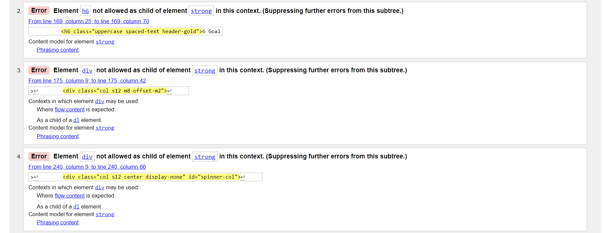
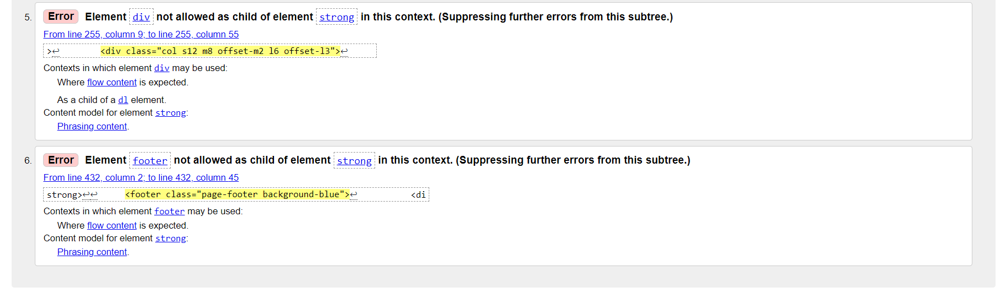


All of these errors were due to an unclosed ```<strong>``` tag and an unclosed ```<h6>``` tag. I found the unclosed tags and closed them and the errors were resolved.

### Testing: Profile

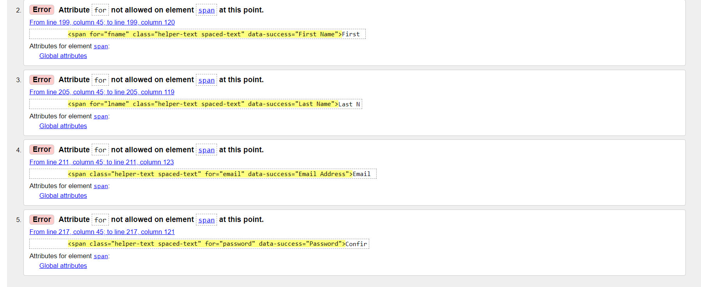

The input fields on the profile page originally had labels describing them which used ```label``` tags. When moving to validating the forms, it was easier to do this with helper-text which use ```<span>``` tags with the ```helper-text``` class and ```data-success```/```data-error``` attributes. In doing so, it looks like the ```for``` attributes from the label tags got left over. I have removed these and the error is resolved. 

### Testing: Savings History

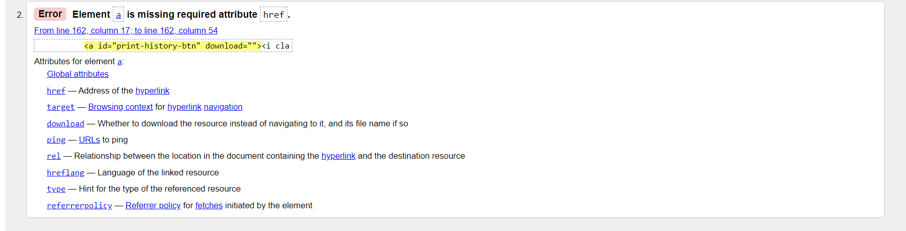

This anchor tag has been switched to a ```<span>```, as it is not acting as a link with a ```href```. This error has been removed. The ```download``` attribute has also been removed, as this no longer functions as an automatic download link. 

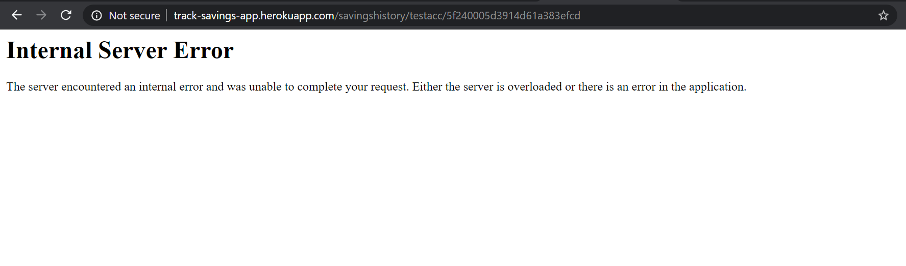

After deploying the app to Heroku, setting Debug to ```Debug=False``` and trying to navigate to the goal history page, this error was returned. I hadn't worked on the savings history age since completing it and I wasn't sure why this was happening. I switched debug back to ```Debug=True``` and navigated to the page. The following error was returned:

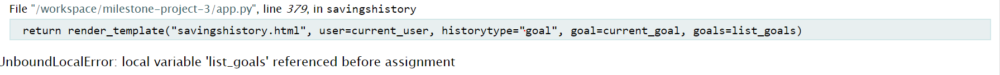

In the [app.py](app.py) file I had at some point removed the assignment of the list_goals variable. By readding this, the error was removed and I could now navigate the goals history page for all goals. 

### Testing: View Goal


The type attribute is set in the css file loaded from the [chart.js](https://www.chartjs.org/) file. Chart.js is required to make the charts on the view goal pages functional, so it's css file is an external dependency and has been left as it is. 

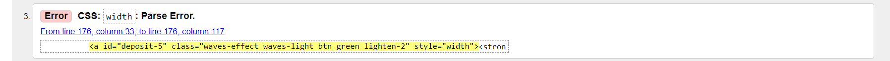

This was left-over from inline styling when developing the app. I have removed it and the validation error has gone. 

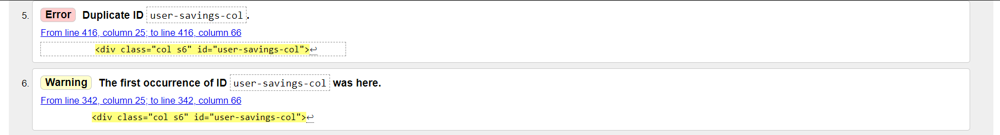
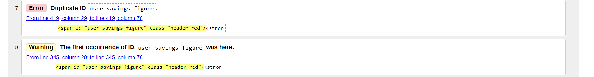
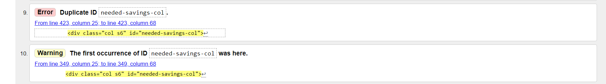
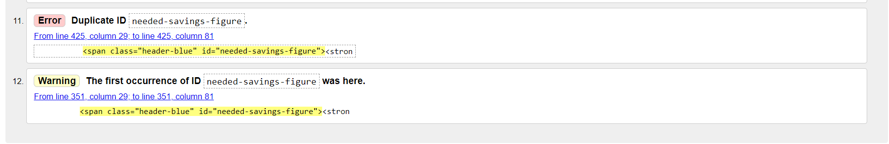

Four sets of duplicate id's exist from when the deposit and withdraw buttons in the second column were copied into the first column to be displayed near the top of the page on mobile devices. I have switched the id's into classes, and updated their css selectors accordingly. This removed the validation error.

### Testing: 404

No errors were found.

### CSS

CSS Validation has been carried out on the app's [style.css](static/css/style.css) file using the [W3C CSS Validation Service](https://jigsaw.w3.org/css-validator/). 

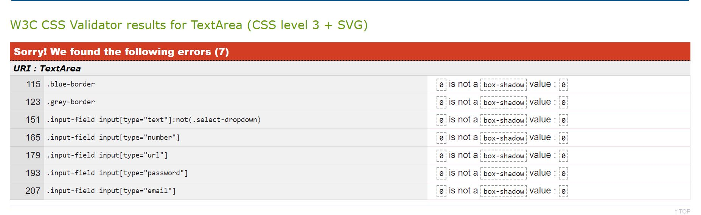

The CSS Validation returned seven errors. These were all where I had set the ```box-shadow``` value of borders and input fields to 0 to try to override Materializes default classes, but this is not valid CSS and it hadn't worked anyway. I went into the [style.css](static/css/style.css) file and replaced these styles with ```box-shadow: none;``` which both works to hide the box shadow and passes the CSS validation. 

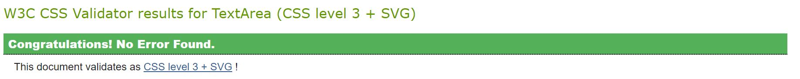

I re-ran the app's CSS through the validator again and it passed with no errors or warnings. 

### JavaScript
JavaScript Validation has been carried out on all ```.js``` files in the app's [static/js](static/js) and any ```.html``` files that contain JavaScript that uses Jinja Templating. This was done by running the code through the JavaScript Linter, [JSHint](https://jshint.com/).

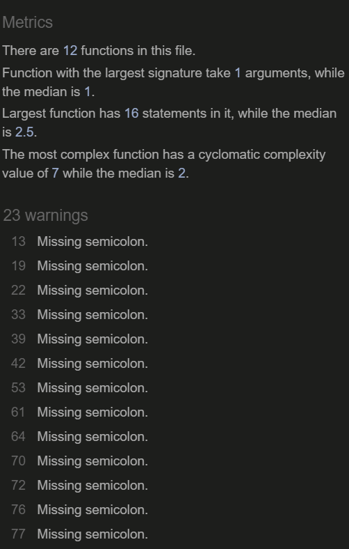

When I ran all the files through the linter, each file flagged up about 20-30 missing semicolons, which I have since added in to the files. 

All of the functions in the files have a reasonably low cyclomatic complexity value (between 1 and 6 across the files) which means that the JavaScript is not overly reliant on nesing several functions inside other functions inside other function within function within function. 

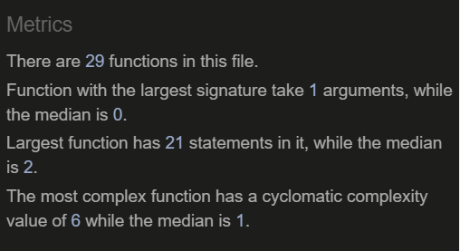

When validating the JavaScript in the [dash.js](static/js/dash.js) file, an error showed that I had not declared the given_url variable within the promise that fetches the image URL from Unsplash based on the entered keyword. I fixed this by assiging the variable with ```let given_url = <fetched_url>```. I chose ```let``` as this given_url variable only needs block scope, as it is only used within the promise. 
 
Also in the [dash.js](static/js/dash.js) file, I had used ```.addClass(invalid)``` when the invalid class to be added should be contained within quotation marks. I fixed this by editing it to ```.addClass("invalid")``` and the error was removed. 

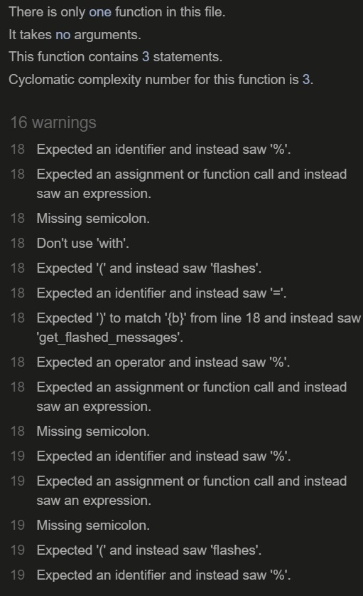

Some of the JavaScript in the ```.html``` files contains Jinja Templating, and JSHint can't process this well. Wherever the Jinja Templating occurs in the JavaScript, JSHint returns errors. The functionality of the app relies on this Jinja Templating in the JavaScript code, so it has been left in. 

### Python

Most of the bugs in the python code were ironed out while developing the app and doing the manual testing of the app. 

Before deploying the app, I checked through the [app.py](app.py) file to double check for indentation and formatting errors. These were mostly fixed by removing trailing whitespace and ensuring there were two blank lines between functions. 

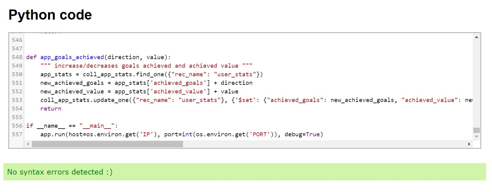

I passed the python code to a python code validator and it didn't return any errors. That, along with the combined manual testing of the app provides some level of confidence that all of the python code is functional. 

## User Stories Testing

### Story One 

**A reminder of Story One:** "I've always dreamed of buying an old VW camper van. It's a long-term goal but I want to start making progress towards it. I want to save a little bit here and there, and work out when my goal might be achievable."

#### Testing Story One 

- When a user creates a goal, they can set the end-date up to 2100. That's allows for some super long-term goals.
- Users can save as frequently or infrequently as they like, and there is no minimum amount to deposit. 
- Progress towards the end goal is visualised by the progress bar underneath the goal image and the progress doughnut chart. 
- Users get an estimated end-date of their goal as soon as they start to make deposits. This adjusts in relation to their savings activity as their deposits/withdrawals continue over time. If it looks like they'll be ahead of schedule, the app asks them if they want to increase their end goal. If it looks like they wont quite meet their target in time, it asks them if they'd like to extend their end date.  

### Story Two

**A reminder of Story Two:** "I want to buy a house this time next year. I know how much I need to save in total, and I'm happy to save a little extra each month to meet my goal if I need to."

- Users set their end total and end date, and the app then lets them know how much they will need to save each week/day to achieve this. This updates with each deposit/withdrawal, so if this user is happy to save a little extra each month, the app will let them know exactly know much that needs to be. 

### Story Three

**A reminder of Story Three:** "My kids really want to go to Disneyland. They get an allowance for helping around the house and they save it towards their dream holiday. At the moment we keep track of it on paper, but it'd be great to do this on an app so that they could see their savings grow towards their goal in a more visual way."

- The app definitely provides progress visualisation. While the app hasn't been designed to be specifically child-friendly, with the help of a parent, this could definitely be an engaging app to encourage children to save, for example, the goal image can be set to one of disneyland, and the colour coordination between deposits/withdrawals can be easy for children to understand, even while statistics behind them might not be. 
- The progress bar and progress pie chart also provide great visualisation for children to understand how their savings are progressing. 
- The savings history page keeps track of all the savings and withdrawals, so it's a good way for parents to keep track of what their children have been depositing and withdrawing. 

### Story Four

**A reminder of Story Four:** "Usually I'm saving towards three or four different things. A couple are usually smaller goals that I can meet quite quickly, while others might be a bit more long term with higher amounts needed to be saved. It'd be great to track my savings for all of these in a single app, and keep a record of the goals I've achieved to keep me motivated."

- Users can set up to four goals, so they can save towards different things at the same time. Each goal has separate end dates and end totals. The end dates can be as close as tomorrow, or as far away as December 2100, so there's plenty of scope for long-term and short-term goals. 
- Savings history is recorded by the app even after old goals are completed/deleted and new ones created in their place. This means it's easy to keep track of them in a single place. 
- All achieved goals are displayed in a table on the dashboard, so there's a visbile record of them for the user. 

## Manual Testing

For the manual testing of the webpage, I have tested each section on three different physical devices - a mobile device (Huawei P10), a tablet device (Lenovo Tab E10), and a desktop device (HP Pavilion 14). I have also rerun this testing using the AmIResponsive tool and InfoByIP's Website Resolution Checker to test the wesbite for a screen with high resolution as my largest computer screen is 14". I noticed that the app often shows visual bugs when inspecting it using Chrome Developer Tools that weren't present when viewing it on the actual physical device. I have tried as best I can to fix these both for physical devices and Chrome Developer tools. 

### Navigation 

- On the deployed version of this app, all links now lead to the correct location. 
- The links change according to whether a user is in session or not. 
- If a user is in session and tries to access the log in or signup pages, they are redirected to their dashboard. A message is flashed to the user feeding back to them why they have been redirected. 
- If a user is logged out and tries to access the dashboard, view goal, savings history or profile pages,they are redirected back to the login page. A message is flashed to the user feeding back to them why they have been redirected. 
- If a user tries to navigate to the create goal card while they already have the maximum number of goals, they are redirected to the dashboard and a message is flashed to the user to feedback to them that they cannot create more than four goals. 
- The nav bar is responsive to viewport width, with links displayed to the right of the navbar on large devices, and links hidden in a sidenav on smaller devices which is opened by clicking the nav toggle bars icon.
- Links between cards on the dashboard, viewgoal, profile and savings history page all display their respective cards and hide the other cards on the page. 
- The goal links in the FAB menu all lead to the correct goals. When goals are deleted, these links and cards are removed. 

### Index 

- The carousel slides automatically between panels. 
- On touchscreen devices, the carousel slides on finger swipe. 
- The login and signup buttons display in the carousel if no user is in session. If a user is in session, the dashboard and profile buttons are displayed. All four buttons lead to the correct destinations.
- If no user is in session, the three index cards below the carousel show three mockups of the app, one with a user signing up to the app, one with a user saving to their goal, and one where a user has achieved their goal. The buttons below each card all link to the correct locations. 
- If a user is in session, the three index cards below the carousel show three mockups of the app, one with a user's dashboard, one with a user's profile, and one with a user's savings history. The buttons below each card all link to these respective locations. 
- On testing, the cards were not of a uniform height on various different viewport sizes. I fixed this by adding in a ```min-height``` style to the cards. 

### Log In

- The login form functions as a log in form - users can only login to track with a username and password that are already registered. 
- If a user tries to login with an incorrect username, they are redirected to the signup page and a message flashed to feedback why they have been directed. 
- If a user tries to log in with a correct username, but incorrect password, they are redirected back to the login page and a message flasehd to feed back that their password was incorrect. 
- The link below the log in card redirects the user to the sign up page. 

### Sign Up

- The sign up form successfully registers a new user on submission. The user is then redirected to the log in page and asked to log in with their new details. The user can sign in with their username and password straight away. 
- If a user tries to signup with a username or email address that already exists, they are redirected to the signup page and a message flashed to feedback that they cannot use that username or password. 
- The form does not submit with any empty or invalid fields. 
- The link below the sign up card redirects the user to the log in page.

### Dashboard

- The users dashboard is displayed on signing in to the app. 
- I have tested the dashboard at all stages after signing up: creating the first goal, making the first deposit, adding a second goal, deleting a goal, achieving a goal. The Jinja Templating works as expected to display the correct elements, although this did take some time to get correct. 
- The recent activity card is displayed once the user has made their first deposit. 
- The achieved goals card is displayed once the user has achieved their first goal.
- All dashboard cards are hidden when the create new goal link is clicked.
- On small devices, the FAB menu is hidden from the bottom-right of the page. 
- Adding a goal adds the new goal straight away. If a user sets the image by URL, this image shows up in the FAB goals menu. If the user sets the image by keyword, a random image relating to it is fetched from unsplash. This often takes a few seconds for the promise to complete, and the spinner correctly displays to the user while this takes place.
- I noticed that after making a new account, the Jinja Templating didn't appear to be working correctly as the app was indicating that the user had no goals but goals were showing on the dashboard. On investigation, this was because when a user was deleting their profile, the record was removed from the users collection in MongoDB but the goals that were linked to that username remained in the ```goals``` collection. I fixed this by adding in python to remove a users goals when they delete their profile. 

### View Goal

- A user can only access the view goal page once they have created a goal. 
- All the cards display in the correct order. On large devices, the deposit and withdraw cards are moved to the right-hand column. On small devices, where there is only one column, they are moved to be right underneath the main card. 
- Once the first deposit has been made, the recent activity card, deposits gauge and deposits statics cards appear. Before this, they are hidden. 
- The savings forecast card updates on every deposit/withdrawal. The maths behind it is pretty basic, but it does work and gives a rough idea of when the goal will be completed with the current rate of savings activity - however, these statics become a bit distorted after one large deposit/withdrawal. 
- The deposit and withdrawal cards open upon clicking their respective buttons. If the user's current saved total is zero, then the withdraw button is disabled and the withdraw card cannot be accessed. Once it is accessed, the user cannot withdraw more than the current amount they have saved. 
- Messages are flashed to the user as soon as they deposit or withdraw any amount, with the amount involved and the action ("withdrawn or deposited"). 
- The percentage progress charts, deposits gauge, and deposit/withdraw statistics update with every withdraw/deposit. 
- The user can edit the goal by navigating to the edit goal card. All fields are validated just as they are when creating the goal. After editing the goal, the user is redirected back to the goal and can see the changes that have been made straight away. 
- If the user edits has already completed the goal, but edits the goal to increase the end target amount, and the goal is no longer achieved, the achieved boolean value for the goal is reset to ```False``` and all the "congratulations, you've achieved your goal" messages are hidden again. The percentage progres also resets. 
- The user can only delete a goal by confirming their password - the hashed version of this input must match the hashed password stored in MongoDB on their user record. If it does not match, an error message is flashed to the user. 
- When a goal is deleted, the user is redirected to their dashboard.
- After the app was deployed, I noticed that the favicon was never displaying in the pages tab on any of the goal pages. The link was in the base.html file, and templated onto the other pages by Jinja Templating, so the link was not changing on any of the pages. I inspected the icon link using Chrome Developer Tools, and the link was there and correct. I cleared the cache, viewed it in incognito mode, and on a different browser, and it still wasn't showing up. I don't know why this way. I tried hosting the image on an external site and linking to it via it's image address and this worked. The favicon now displays on all pages. 

### Profile

- On deploying the app, I noticed that the profile card was stretching to occupy most of the page. On inspecting this in developer tools, I could see it was because I had accidentally set a ```min-height: 85vh``` to the card rather than the cards container. I fixed this by moving the style to the cards container (the page container) and it was corrected.
- The cards are navigatable by the links within them. All links display/hide the correct cards. 
- The update profile link leads to the update profile card. On successfully submitting this form, the users profile is updated straight away.
- The update password link leads to the update password card. On successfully submitting this form (which requires the two new passwords match), the password is updated only if the old password entered matches the user's password stored in MongoDB once it has been hashed. If it doesn't match, the user is redirected to the profile page and a flashed message lets them know they did not confirm their password successfully.  

### Savings History

- If a user is viewing their full user history, the user's name is displayed below the header. 
- If a user has navigated to the page via a url containing the goal id (i.e. from the view goal page), then below the savings history header, the goal name is shown. 
- The print icon opens the print diaglog. The user can then save the page to a PDF or send it to a printer. 
- The full savings history table shows the amount of money the event relates to, and if this was a deposit, it is in green. If it was a withdrawal, it is in red. It then shows the goal name that the activitiy relates to, and then the date it occured on. The table is ordered in reverse chronological order. 
- The goal savings history table shows the amount of money the event relates to, and if this was a deposit, it is in green. It also shows the date the activity occurred on. It does not show the goal name in the table, as this is at the top of the savings history page and all activity relates to the same goal. The table is ordered in reverse chronological order. 

### 404
- The 404 page displays whenever a user tries to navigate to a URL within the app that doesn't exist. 
- If a user is in session, the button on the 404 page takes the user back to their dashboard. 
- If a user is not in session, the button on the 404 page takes them back to the index page. 

### Log Out
- Clicking the log out button successfuly logs the user out and clears the session. 
- On logging out, the user is redirected to the index page. A message is flashed to the user to feedback to them that they have been logged out of their account. 

### Footer 
- The footer displays across the full width of the viewport and is always located at the bottom of the page. 
- On large devices, the footer links are displayed to the right and the brand logo to the left.
- The brand logo links back to the index page.
- On small devices, the footer splits into two rows, with the brand logo on top and the footer links below it. Both brand logo and links are centered. 
- The footer links display links to the index, log in and sign up pages if no user is in session. If a user is in session, the links displayed are for the index, dashboard, and profile pages, and to log out. All links lead redirect the user to the correct locations. Clicking log out logs the user out of the app straight away and redirects them to the index page. 

## Bugs Fixed 

- Removed type attribute from JavaScript link on index page. 
- Closed previously unclosed ```<strong>``` tag and unclosed ```<h6>``` tag on dashboard page. 
- Removed ```for``` attributes from helper-text ```<span>``` tags on profile page forms. 
- Switching anchor tag to span around print icon on savings history page. 
- Reassigning list_goals variable for loading goal savings history pages.
- Removed leftover inline style attribute from view goal page. 
- Removed duplicate id's on view goal page by switching them into classes and updating the css selectors accordingly. 
- Added a ```min-height``` style to index cards to make them a uniform size on across all viewports. 
- Removing the ```min-height: 85vh``` style from the profile card that was causing it to stretch. 
- Deleting a users goal when they delete their profile so that they don't reshow in a new account if that username is used again.
- Hosted the favicon image externally so that it can be accessed on all pages by its image address. 
- Defined the ```given_url``` variable on in the [dash.js](static/js/dash.js) file using the ```let``` variable type. 
- Added quotation marks around an invalid class that was missing them the [dash.js](static/js/dash.js) file. 

## Bugs Unfixed

- The href attributes on the outer divs of each carousel panel on the index page still throw up an error. Removing them would mean the carousel no longer functions. The code is taken from [Materialize's Carousel](https://materializecss.com/carousel.html) and in the future could be replaced with a custom carousel. 
- The Chart.js css file that gets injected by the chart.js CDN has the type set to ```"type=text/css"``` which throws an error when testing and states it must be ommitted. As an external file, I can't do this. 
- There is a tiny (2px or 3px) gap between the navbar and the top of the carousel on the index page. I have tried to fix this using different css styles, and playing around with it in developer tools. I don't know how to make it go away and it's still there in the deployed version. 
- If a user does something that triggers a flashed message multiple times in quick succession (i.e. repeatedly clicks submit with an invalid field), the flashed messages it triggers rack up and display one after the other, even filling the whole page. I am sure there is an easy way to resest this or clear flashed messages on each event, but I haven't found it yet. 
- If a user uploads an image URL on creating a new goal that is not an image url (think ```"notanimage.jpg"```) the form will still validate it as an image URL. When the user then goes to their view goal page, they will see a broken image link where the image should be. I have not figured out a way yet to validate this further other than the basic checks I have already put in. The simplest thing may be to find a way to detect if there is a broken image link, and if there is, inject a url for a placeholder image and flash an error message instead. 
